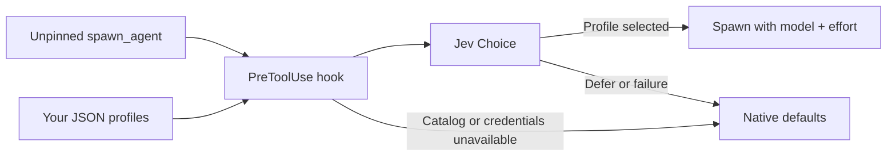

<div align="center">

# Codex Subagent Router

**Describe the mission. Let Jev pick the model.**

AI model routing for native Codex subagents, powered by Jev and your task profiles.

[](https://github.com/guilhem/codex-subagent-router/actions/workflows/verify.yml)
[](#quickstart)
[](plugins/codex-subagent-router/.codex-plugin/plugin.json)
[](https://docs.typesafe.ai)
[](LICENSE)

[Quickstart](#quickstart) · [How it works](#how-it-works) · [Task profiles](#task-profiles) · [Routing behavior](#routing-behavior) · [Decision log](#decision-log) · [Contributing](#development--contributing)

</div>

Reading logs, implementing a feature, and reviewing an architectural change call
for different strengths. Define which models fit which work; the router asks
[Jev](https://docs.typesafe.ai) to choose a profile whenever Codex delegates
without an explicit model, reasoning effort, or agent type.

- **Native delegation.** One `PreToolUse` hook on `spawn_agent`; no extra
  agent-facing tool or routing service to run.
- **Your models, your rules.** Plain JSON profiles describe the tasks each model
  fits. Edits take effect on the next delegation.
- **Explicit choices win.** Pin a model, effort, or agent type to bypass routing.
  If routing is unavailable or Jev defers, native inheritance/defaults apply.

## Quickstart

You need a Codex host with native `spawn_agent` and plugin `PreToolUse` support
and a **TypeSafe API key**. The models and reasoning efforts in your profiles
must be available on your Codex host.

### 1. Install the plugin

```sh
codex plugin marketplace add guilhem/codex-subagent-router --ref main
codex plugin add codex-subagent-router@codex-subagent-router
```

The plugin includes the TypeSafe SDK in a ready-to-run JavaScript bundle.
Codex Desktop supplies its Node runtime; there is no Python, npm, or SDK to
install. With standalone Codex CLI, have Node.js 20+ on `PATH` if no Codex runtime
is available. The launcher checks Codex's runtime locations before the system
`node`; `CODEX_MCP_NODE_PATH` can point to a Node executable when needed.

### 2. Set your API key

Create a plain-text file named `api-key` in `$CODEX_HOME/subagent-router/`, or
`~/.codex/subagent-router/` when `CODEX_HOME` is unset or empty. In Bash
(Linux/macOS), paste this block, then enter your key at the hidden prompt:

```bash
router_dir="${CODEX_HOME:-$HOME/.codex}/subagent-router"
mkdir -p "$router_dir" &&
(read -rsp 'TypeSafe API key: ' key && [ -n "$key" ] &&
  install -m 600 /dev/null "$router_dir/api-key" &&
  printf '%s\n' "$key" > "$router_dir/api-key")
```

The key is not echoed or saved in shell history. The file is readable and
writable only by your user (`0600`); empty input leaves an existing key unchanged.

Alternatively, set `TYPESAFE_API_KEY` or `JEV_API_KEY` in the environment of
the process that launches Codex. The router uses the first nonempty value in
this order: `TYPESAFE_API_KEY`, `JEV_API_KEY`, then the `api-key` file. It never
loads a workspace `.env` file.

### 3. Add your first profiles

```sh
mkdir -p "${CODEX_HOME:-$HOME/.codex}/subagent-router"
```

Create these files in that directory. These example model IDs are host-dependent;
replace them with models and reasoning efforts your host supports.

**`myteam-routine.json`** — evidence collection and existing checks:

```json
{
  "description": "Read files, collect logs, or run existing checks for a clearly scoped task. No code changes or complex diagnosis.",
  "model": "gpt-6-luna",
  "reasoning_effort": "max"
}
```

**`myteam-implementation.json`** — code changes and standard review:

```json
{
  "description": "Implement or test code under a clear contract, or perform standard technical review. Defer complex architectural decisions.",
  "model": "gpt-6-sol",
  "reasoning_effort": "high"
}
```

### 4. Trust the hook and delegate

Review and trust the plugin hook in Codex `/hooks`, then start a fresh session
with the API key available. Installing a plugin does not automatically trust its
hooks; see the [Codex plugin documentation](https://developers.openai.com/plugins/build/plugins).

Ask Codex to delegate a task, for example:

> Delegate a check of the existing test suite. Summarize failures and leave the
> model and reasoning effort to the router.

The native `spawn_agent` call should describe the mission and leave `model`,
`reasoning_effort`, and `agent_type` unset or `null`. Jev then chooses among your
profiles, or defers when none fits.

> [!IMPORTANT]
> Personal agent instructions that require explicit model or effort values on
> every spawn bypass automatic routing. Explicit settings always take precedence.

## How it works



The hook reads your profiles and sends the delegated mission, profile identifiers,
and profile descriptions to TypeSafe in one Jev `Choice` question. Jev can select
a profile or `defer`. A selected profile supplies `model` and `reasoning_effort`;
the mission and all other spawn arguments stay unchanged.

The router handles a text `message` or text-only `items`. It does not hardcode
model capabilities or task categories. A selection requests a model from Codex;
it is not proof of which provider ultimately executes the subagent.

## Task profiles

Profiles live directly inside `$CODEX_HOME/subagent-router/`, or
`~/.codex/subagent-router/` when `CODEX_HOME` is unset or empty. Each `*.json` file
defines one choice, identified by its filename without `.json`.

| Field | What to put here |
| --- | --- |
| `description` | The work this profile fits, with enough detail to distinguish nearby choices. |
| `model` | A model ID available on your Codex host. |
| `reasoning_effort` | A reasoning effort supported by that model and host. |

All three fields must be nonempty strings. Several profiles can use the same
model. `defer` is reserved. The router rereads the directory on every delegation
and never writes profiles.

Skills, plugins, and users can contribute profiles to the same directory. Prefix
filenames with the producer's name, preserve existing user-edited files, and
let each producer own installation, updates, and removal. No registration is
needed.

## Routing behavior

| Situation | What happens |
| --- | --- |
| Explicit non-null `model`, `reasoning_effort`, or `agent_type` | Bypasses routing, catalog reads, and provider calls. |
| Valid catalog, credentials, and an unpinned text mission | Jev selects a profile or returns `defer`. |
| Empty, invalid, or oversized catalog | Keeps native inheritance/defaults; no provider call. |
| Missing runtime/key, provider failure, or invalid response | Keeps native inheritance/defaults. |
| Jev returns `defer` | Keeps native inheritance/defaults. |

One invalid profile invalidates the catalog for that call; the router never
silently uses only part of it. Diagnostics and the decision log omit profile
descriptions, missions, credentials, and remote error messages.

<details>
<summary><strong>Limits and retries</strong></summary>

The catalog supports up to **254 profiles plus `defer`**, within the
[255-option Choice limit](https://docs.typesafe.ai/primitives/choice). Larger
catalogs fall back without truncation. The SDK has at most two retries within a
10-second total request budget; Codex caps the hook at 15 seconds. No confidence threshold
is applied.

</details>

<details>
<summary><strong>Routing not taking effect?</strong></summary>

Start with the [decision log](#decision-log): its `reason` names the cause. If a
delegation has no event, check that the hook is trusted and a Node runtime is
available, whether the hook was interrupted, and whether stderr reported a log
write warning. Native defaults are the expected fallback when routing cannot run
or Jev defers.

</details>

## Decision log

The hook appends JSON events for each `spawn_agent` call it evaluates to
`$CODEX_HOME/subagent-router/decisions.jsonl` (`~/.codex/subagent-router/`
when `CODEX_HOME` is unset or empty), one event per line. The file is created
private (`0600`).

```sh
log="${CODEX_HOME:-$HOME/.codex}/subagent-router/decisions.jsonl"
tail -F "$log" | jq -c .                        # follow live decisions across rotations
cat "$log.1" "$log" 2>/dev/null |
  jq -c 'select(.outcome == "error")'           # routing failures, backup included
```

```json
{"ts":"2026-09-24T10:00:00.000Z","outcome":"routed","reason":"selected","duration_ms":812,"session_id":"…","tool_use_id":"…","profile":"myteam-implementation","model":"gpt-6-sol","reasoning_effort":"high","confidence":0.85}
```

| `outcome` | `reason` | Meaning |
| --- | --- | --- |
| `routed` | `selected` | Jev chose `profile` with `model` and `reasoning_effort`. |
| `deferred` | `defer` | Jev found no fitting profile; native defaults apply. |
| `skipped` | `pinned` | The spawn already set `model`, `reasoning_effort`, or `agent_type`. |
| `skipped` | `no_mission` | No text `message` or text-only `items` to route. |
| `skipped` | `no_catalog` | No profile files exist. |
| `error` | `catalog_invalid` | A profile file is invalid; stderr names the problem. |
| `error` | `no_key` | No API key was found. |
| `error` | `http_<status>`, `timeout`, `connection`, `sdk_error` | The TypeSafe request failed. |
| `error` | `invalid_response` | TypeSafe answered with an unusable response. |
| `error` | `output_error` | A profile was selected, but writing the hook output failed. |
| `error` | `invalid_input`, `internal_error` | The hook could not read its input or failed before a decision. |

Routing errors are non-blocking and also print a short diagnostic to stderr.
`confidence` is Jev's reported confidence. `session_id` and `tool_use_id`
come from the Codex hook input and correlate an event with its session and spawn
call. If the log cannot be written, the routing result is unchanged and stderr says
`Subagent router decision log unavailable`.

A `routed` event records the profile Jev **selected**; it is written before the
hook output is sent and does not prove Codex received or applied it. An
`output_error` event can follow for the same call (same `tool_use_id`). The
subagent's own session shows the model Codex actually applied; neither proves
which provider served it. A hook that never starts (untrusted, no Node runtime)
writes no event; one that is killed (for example by the 15-second Codex timeout)
may leave no event.

When the next event would take `decisions.jsonl` past 1 MiB, the router renames
it to `decisions.jsonl.1`, replacing the previous backup, and starts a new file.
The log therefore stays around 2 MiB. Hooks running at the same moment can push
the current file slightly past 1 MiB, or rotate twice and replace the backup
sooner. Both files can be deleted at any time.

## Development & contributing

From a repository checkout:

```sh
npm ci
npm run build
npm test
npm run check:dist
git diff --check
```

Development requires Node.js 20+ and npm. Commit the generated
`plugins/codex-subagent-router/dist/jev_router.mjs` alongside source changes.
`check:dist` rebuilds in memory and rejects a stale bundle. The bundle includes
the project and SDK license notices; it runs without `node_modules` and does not
download dependencies at startup.

To test a checkout as a plugin, add its absolute repository path as a marketplace
and install `codex-subagent-router@codex-subagent-router`. Use an isolated
`CODEX_HOME` for tests that add profiles or change hook trust.

[Bug reports](https://github.com/guilhem/codex-subagent-router/issues) and focused
pull requests are welcome. Include your Codex/Node versions and a minimal
example with credentials and private mission content removed.

## License & credits

[MIT](LICENSE). Extracted from
[Astra Advisor PR #12](https://github.com/guilhem/astra-advisor/pull/12), with the
small MIT-licensed adapter attribution to
[jev_codex](https://github.com/Madikhan33/jev_codex). Powered by the
[TypeSafe JavaScript SDK](https://www.npmjs.com/package/@typesafe-ai/sdk).
